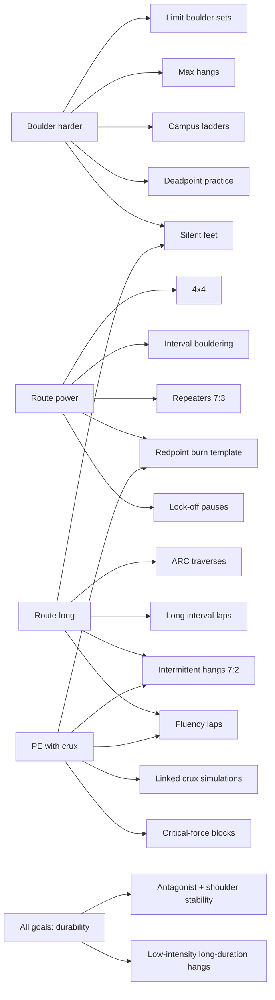
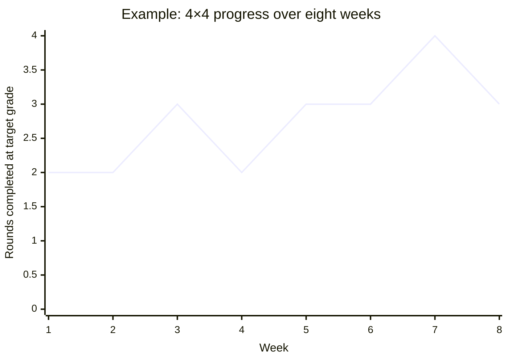

# Drill library for climbing performance across four goals

### Limit boulder sets

**Evidence level:** Coach-practice (supported by competition time–motion and strength/power determinants). 

**Purpose (targets):** Maximal bouldering strength/power and problem-solving under near-limit intensity. Best for Goal: **bouldering**; also supports “crux” intensity for hard sport routes.

**Mechanism:** High-intensity attempts bias neural recruitment and intermuscular coordination; long rest preserves output so the limiting factor is strength/power rather than metabolic fatigue. The relevance matches bouldering attempt structure (short bursts with rest). 

**Execution (session template):**
- **Setup:** Choose 3–6 problems or sequences at/above current limit (you should fail within 1–4 moves when fresh, or require multiple high-quality attempts to link).
- **Work:** For each problem, take **3–6 attempts**. Each attempt should be ≤20–40 seconds of high output (stop if you start “thrashing”).
- **Rest:** **3–6+ minutes** between hard attempts (longer if power is dropping).
- **Intensity:** RPE **9–10** (max effort with good form).
- **Total volume target:** 12–25 “quality attempts” total, not counting warm-ups.

**Progressions:**
- Increase difficulty by hold size/angle/style, not by shortening rest.
- Progress attempt quality first: fewer “sloppy” attempts, more attempts that reach the same high point.

**Regressions:**
- Reduce steepness or hold intensity while keeping coordination demands.
- Use “limit moves” (single-move practice) instead of full problems.

**Coaching cues:**
- “One intention per attempt” (change one variable: beta, grip, timing).
- “Stop before form leaks” (power sessions are quality-limited).

**Safety considerations:**
- Avoid adding campus work on the same day early in a cycle; both are high stress for fingers/shoulders. Overuse risk management is central. citeturn13search0turn16view0

**Suggested weekly frequency:** 1–2 sessions/week, separated by 48–72 hours if combined with other high-intensity finger drills.

**Progress metrics:** Highest benchmark move linked; attempts-to-send; “quality attempts” completed; subjective output drop-off (e.g., power score 1–5).

| Drill | Goal | Protocol | Progress metric | Evidence level |
|---|---|---|---|---|
| Limit boulder sets | Boulder harder / crux strength | 3–6 limit problems; 3–6 attempts each; 3–6+ min rest | Attempts-to-send; highest move linked | Coach-practice |

### Max hangs on hangboard

**Evidence level:** Peer-reviewed (protocol parameters described and widely used in research/practice). citeturn20view0turn8search0

**Purpose (targets):** Max finger force (contact strength ceiling). Best for Goal: **bouldering**, supports all rope goals by lowering relative intensity of holds.

**Mechanism:** Heavy isometric loading increases maximal force capacity via neural and muscular adaptations; higher max reduces %MVC used on holds, plausibly improving endurance downstream. 

**Execution (classic protocol):**
- **Setup:** 18–22 mm edge (or 20 mm); consistent grip (often half crimp). Add weight or use assistance to hit target. Use a timer and strict scapular set.
- **Warm-up:** progressive easy hangs and easy climbing first.
- **Work:** **6 × 10 s** hangs at **85–95% of 1RM**.
- **Rest:** **2 minutes** between 10 s efforts.
- **Intensity:** RPE **9–10**, but the final reps should be near-max while still *clean*.
- **Stop rule:** terminate session if pain is sharp or if form degrades (shoulders rising, elbow bend changing, uncontrolled swing).

This dosing is explicitly described as the Max Hangs protocol in a large-scale retrospective evaluation of hangboard programs (using a standardized definition). 

**Progressions:**
- Increase load 1–2% when all 6 reps are clean across two sessions.
- Alternatively, keep load and reduce edge depth only after several weeks (more aggressive).

**Regressions:**
- Use foot assistance to maintain intensity with less absolute finger stress.
- Use fewer reps (e.g., 4 × 10 s) during weeks with heavy climbing.

**Coaching cues:**
- “Set the shoulder blades; hang tall.”
- “No jerking into the hang; ease into tension over ~1 second.”

**Safety considerations:**
- Avoid max hangs when skin is split or when finger pain persists next morning; injury reviews emphasize careful load management for overuse. 

**Suggested weekly frequency:** 1–2×/week (often 1× when climbing volume is high).

**Progress metrics:** Total load held (BW + added − assistance); strength-to-weight ratio; perceived grip quality.

| Drill | Goal | Protocol | Progress metric | Evidence level |
|---|---|---|---|---|
| Max hangs | Boulder harder; supports all | 6×10 s @ 85–95% 1RM; 2 min rest | Max added weight or reduced assistance | Peer-reviewed |

### Low-intensity long-duration hangs

**Evidence level:** Peer-reviewed (population-scale retrospective evidence; useful as low-cost adjunct).

**Purpose (targets):** Increase finger strength with lower per-session stress; useful when high-intensity finger loading is limited by recovery or injury risk. Best for Goal: all, especially **long-route** phases and “maintenance.”

**Mechanism:** Sustained submax isometrics may improve force transfer and tissue tolerance; in large real-world datasets, low-intensity long-duration protocols produced finger strength improvements comparable to max hangs, and combining low + high intensity showed additive effects. 

**Execution (practical adaptation of “low intensity long duration” concept):**
- **Setup:** edge and grip you can load lightly; keep feet on ground or chair.
- **Intensity:** “light strain” target (approximately submax; the study reports low intensity and frequent loading as the defining features). citeturn19view0
- **Work:** 10 minutes total time 10 seconds on 20 seconds off, alternate finger positions, front two, back three, etc.
- **Rest:** 20 s after 10 s on
- **RPE:** 4–6.

**Progressions:**
- Increase total time-under-tension modestly (e.g., +1–2 minutes) or add small load while keeping RPE moderate.
- Pair with max hangs (separate sessions at least 6 hours apart) if recovery permits; additive effects were observed when protocols were combined. 

**Regressions:**

- Reduce duration if any finger irritation appears.
- Change grip to open-hand or jug-like if crimp aggravates symptoms.

**Coaching cues:**
- “Smooth load, smooth unload.”
- “Keep it easy enough that you could repeat tomorrow.”

**Safety considerations:**
- Low intensity does not mean zero risk; pulleys/tendons still load. Use symptom check the next morning. 

**Suggested weekly frequency:** 2–4×/week (especially in base phases), or 1–2×/week as maintenance.

**Progress metrics:** Total weekly time-under-tension; next-day symptom score; periodic max hang test as outcome.

| Drill | Goal | Protocol | Progress metric | Evidence level |
|---|---|---|---|---|
| Low-intensity long-duration hangs | Maintenance; endurance phases | ~10 min easy hangs (feet assisted) | Weekly time-under-tension; symptom trend | Peer-reviewed |

### Campus board ladders and power moves

**Evidence level:** Peer-reviewed (intervention with explicit exercise menu and rest). 

**Purpose (targets):** Upper-limb explosive pulling and contact strength coordination (power/RFD proxies). Best for Goal: **bouldering**, and for cruxy rope routes requiring explosive moves.

**Mechanism:** Campus board training is highly specific to dynamic pulling without feet; in a five-week randomized intervention, campus training improved climbing-specific attributes (strength on climbing holds, maximal reach, moves-to-failure, and bouldering performance in some dosing patterns). 

**Execution (peer-reviewed exercise menu):**
- **Setup:** campus board with rung depth options (study used **25, 20, 15 mm** rungs and instructed climbers to use the shallowest rung they could and progress shallower when possible). 
- **Exercises (examples used):**
  - **1–4–7–10** (pull-through each move; match on top). 
  - **Ladder** (one hand stays; other climbs rung-by-rung to max reach and reverses). 
  - **1–2–3** (reach ~75% max then pull through for max). 
  - **10RM** (10 consecutive moves so move ten is near exhaustion). 
- **Sets:** **4 sets** per exercise performed in-session. 
- **Rest:** **2–3 minutes between sets** (regulated by perceived exhaustion), and all efforts performed with **maximal effort and velocity**. 
- **Technique constraint:** supervised instruction emphasized not using full crimp in their protocol.

**Progressions:**
- First: increase movement quality and consistency at same rung depth.
- Then: progress rung depth (25 → 20 → 15 mm) or increase reach distance.
- Option: shift frequency depending on goal—two vs four sessions/week produced different adaptation emphasis (RFD vs bouldering performance) in this study context. citeturn9view0

**Regressions:**
- Foot-on campus ladders (reduces stress) or perform controlled “big move” pulls on jugs.

**Coaching cues:**
- “Quiet hips; don’t thrash.”
- “Hit and hold—control the catch, don’t just slap.”

**Safety considerations:**
- Campus board is high stress for fingers, shoulders, and elbows; block periodization and reduced other high-intensity loads are recommended in the intervention discussion. citeturn9view0turn16view0

**Suggested weekly frequency:** 1–2×/week for most; or a short dedicated block (4–6 weeks) with reduced other intensity.

**Progress metrics:** highest rung reached; moves-to-failure; consistent completion of ladder at smaller rungs.

| Drill | Goal | Protocol | Progress metric | Evidence level |
|---|---|---|---|---|
| Campus ladders and power moves | Boulder harder; crux power | 2–3 exercises; 4 sets each; 2–3 min rest; max velocity | Max reach rung; move count; rung depth | Peer-reviewed |

### Hangboard repeaters with 7:3 rhythm

**Evidence level:** Peer-reviewed (a standardized 7:3 repeater structure was used in a 10-week randomized trial). 

**Purpose (targets):** Strength-endurance for finger flexors and repeatability of contractions; most relevant to **short-route power** and **power-endurance with crux**, with some transfer for bouldering “capacity.”

**Mechanism:** Repeated submax isometric loading targets fatigue resistance and strength-endurance; in a 10-week trial, twice-weekly hangboard training improved climbing-specific maximal force outputs, showing that structured hangboard dosing can produce meaningful adaptations beyond regular climbing. 

**Execution (peer-reviewed structure):**
- **Warm-up:** 15 minutes easy climbing/bouldering. 
- **Set structure:** **2 identical sets** separated by **6 minutes rest**. 
- **Within each set:** **6 progressive hang-series**, each with **7 repetitions**. 
- **Each repetition:** **7 seconds hang / 3 seconds rest** (7:3). 
- **Rest between hang-series:** **2 minutes 30 seconds**. 
- **Progression rule:** increase difficulty when it can be done without failure (in the study, difficulty increased by grip conditions such as smaller holds/fewer fingers; timing variables stayed constant). 
- **Intensity (practical):** RPE 7–9 depending on series; early series easier, later series harder.

**Progressions:**
- Advance grip difficulty (smaller hold / fewer fingers) while maintaining completion.
- Keep rhythm constant; change only one variable at a time.

**Regressions:**
- Use larger holds or more fingers; maintain the 7:3 rhythm.
- Reduce to 1 set (instead of 2) during heavy climbing weeks.

**Coaching cues:**
- “Smooth transitions; don’t jump off early.”
- “Maintain scapular position; avoid shrugging.”

**Safety considerations:**
- Volume is substantial; deload every fourth week and avoid stacking with campus or limit bouldering the same day early in a cycle. Overuse prevention strategies emphasize managing cumulative load. 

**Suggested weekly frequency:** 1–2×/week depending on current climbing intensity (2× is the trial dose). 

**Progress metrics:** highest difficulty completed without failure; total completed reps; session RPE drift.

| Drill | Goal | Protocol | Progress metric | Evidence level |
|---|---|---|---|---|
| Hangboard repeaters 7:3 | Route power; PE with crux | 2 sets; each set: 6 series × 7 reps; 7:3; 2:30 between series; 6 min between sets | Difficulty level completed; completion rate | Peer-reviewed |

### Intermittent hangs at 60% MVC with 7:2 ratio

**Evidence level:** Peer-reviewed (optimized diagnostic protocol strongly correlated with lead climbing performance; can be repurposed as a training drill). 

**Purpose (targets):** Lead-relevant forearm endurance (repeatable contractions under a fixed work: rest rhythm). Best for **long-route endurance** and **power-endurance with crux**.

**Mechanism:** The 7:2 intermittent endurance test at 60% MVC was optimized to improve correlation with lead climbing performance; the rep count (with defined force/time tolerances) plus max strength explained a meaningful portion of climbing ability variance.

**Execution (training adaptation of the test):**
- **Setup:** fingerboard with force measurement if available (ideal). If not, approximate 60% MVC by load selection: choose load you can maintain for many reps but that becomes challenging with time.
- **Work:** **7 s on / 2 s off** rhythm. 
- **Intensity target:** ~60% MVC, RPE 6–8 (not max).
- **Sets:** 2–4 sets to “technical fatigue” (stop when you cannot maintain target force/time).
- **Rest between sets:** 3–5 minutes.

**Progressions:**
- Add repetitions before adding load.
- Tighten form: fewer “cheats” (shoulder hitching, swinging, grip shifting).

**Regressions:**
- Lower intensity (more assistance or larger holds).
- Use 7:3 instead of 7:2 if 7:2 is too aggressive early on.

**Coaching cues:**
- “Hit the rhythm; don’t sprint the first half.”
- “Relax all other muscles between contractions.”

**Safety considerations:**
- Although submax, total volume can be large; monitor next-day finger soreness and elbow symptoms. citeturn13search0turn13search6

**Suggested weekly frequency:** 1×/week in mixed plans; up to 2×/week in endurance blocks (separated by easy days).

**Progress metrics:** reps completed with consistent rhythm and minimal deviation; perceived pump at a given rep count.

| Drill | Goal | Protocol | Progress metric | Evidence level |
|---|---|---|---|---|
| Intermittent hangs 60% MVC 7:2 | Route long; PE with crux | 7:2 rhythm at ~60% MVC; 2–4 sets; 3–5 min rest | Reps-to-failure / reps at fixed RPE | Peer-reviewed |

### Critical-force four-minute all-out intermittent test as a training drill

**Evidence level:** Peer-reviewed (reliability established; validation work clarifies interpretation limits). 

**Purpose (targets):** Quantify and train the boundary between sustainable and non-sustainable forearm force; useful for **power-endurance with crux** when you want objective intensity anchors.

**Mechanism:** The “critical force” concept extends critical power; the 4-minute all-out test uses repeated 7 s maximal contractions with short rest (often 7:3) and can yield a “critical force” estimate, though validation work suggests common CF calculations may overestimate sustainable intensity depending on method. 

**Execution (as an occasional drill, not weekly torture):**
- **Protocol (test format):** 24 repetitions of **7 s maximal** hangs with **3 s rest** (7:3) over ~4 minutes has published test–retest reliability work. 
- **Training adaptation:** Instead of all-out, do **2–3 blocks of 2 minutes** at a target force slightly below “end-test” force, with 6–8 minutes rest between blocks.
- **Intensity:** RPE 8–9 for training version.

**Progressions:**
- Increase target force slightly once you can complete all blocks with stable technique.
- Extend total work time (minutes) before increasing intensity.

**Regressions:**
- Reduce contraction intensity or use assistance; maintain the rhythm.
- Use fewer reps or shorter blocks.

**Coaching cues:**
- “Maximal doesn’t mean sloppy—keep the same body position every rep.”

**Safety considerations:**
- High fatigue + intensity is a risk combination; use sparingly and avoid during finger pain flares. 

**Suggested weekly frequency:** 0–1×/week; commonly every 2–4 weeks as a benchmark-focused session.

**Progress metrics:** mean force in later reps (if measured), completion quality, and recovery time required.

| Drill | Goal | Protocol | Progress metric | Evidence level |
|---|---|---|---|---|
| Critical-force style intermittent test | PE with crux | 7:3 rhythm blocks informed by 4-min all-out structure | Later-block force stability; completion | Peer-reviewed |

### Interval bouldering and timed bouldering circuits

**Evidence level:** Peer-reviewed (interval-style bouldering is supported as an effective method in training synthesis; specific implementations vary). 

**Purpose (targets):** Power-endurance and repeatability of hard moves; best for **route power** and **power-endurance**, secondary value for bouldering “capacity.”

**Mechanism:** Training syntheses report that interval-style bouldering can improve endurance-related outcomes and may improve performance when programming is specific and structured. citeturn0search0turn2search3

**Execution (two common variants):**
- **Variant A: work:rest intervals**
  - Work: 20–40 s hard climbing (RPE 8–9).
  - Rest: 20–60 s.
  - Repeat: 8–16 rounds.
  - Sets: 2–3 sets; rest 6–10 min between sets.
- **Variant B: density block**
  - 10 minutes continuous “on/off” bouldering (climb, drop, rest briefly, repeat) at sustainable high effort.
  - Rest: 10 minutes.
  - Repeat: 2 blocks.

**Progressions:**
- Increase total hard work time first (more rounds or longer blocks).
- Then reduce rest modestly or increase problem difficulty one notch.

**Regressions:**
- Use juggier terrain or lower grades; keep the timing.
- Reduce to one set and keep quality.

**Coaching cues:**
- “Don’t sprint round one—pace so round six still resembles climbing.”
- “Shake out efficiently during rests; practice recovery behavior.”

**Safety considerations:**
- High pump encourages grip changes and sloppy catches; stop before repeated uncontrolled falls or finger tweaks. 

**Suggested weekly frequency:** 1×/week in most plans; up to 2×/week in a short power-endurance block with reduced other high intensity.

**Progress metrics:** total hard work completed at target RPE; completion of “last round” quality.

| Drill | Goal | Protocol | Progress metric | Evidence level |
|---|---|---|---|---|
| Interval bouldering circuits | Route power; PE with crux | Timed hard bouts with incomplete rest; 2–3 sets | Total work completed; last-round quality | Peer-reviewed |

### Bouldering 4×4

**Evidence level:** Coach-practice (conceptually overlaps with interval bouldering evidence; specific 4×4 structure is mostly manual/coaching). 

**Purpose (targets):** Power-endurance—ability to execute repeated near-limit moves with accumulating fatigue. Best for **route power** and **power-endurance**.

**Mechanism:** 4×4 is a structured density/interval session that creates repeated high-intensity contractions under limited recovery, similar in intent to interval bouldering approaches noted in training syntheses. 

**Execution (classic coach format):**
- Pick **4 boulder problems** about **2–4 grades below your limit** (hard enough to get pumped, doable when fresh).
- Climb each problem **4 times** with minimal rest between climbs (e.g., step off, chalk, go).
- After completing all 4 problems × 4 reps (16 total), rest **8–15 minutes**.
- Do **2–4 rounds** depending on goal and training age.
- **Intensity:** RPE **8–9**; you should not be failing every rep, but late reps should be shaky.

**Progressions:**
- Increase round count (2 → 3 → 4) before raising problem difficulty.
- Reduce inter-problem rest (within reason) before raising difficulty.

**Regressions:**
- Start with 3×3 or 4×3.
- Use easier problems but stricter “no extra rest” rules to keep structure.

**Coaching cues:**
- “Breathe on every move; relax between hand moves.”
- “Keep feet quiet even when pumped.”

**Safety considerations:**
- Avoid doing 4×4s in the same week as maximal campus blocks early in a season; cumulative fatigue and sloppy catching elevate injury risk. 

**Suggested weekly frequency:** 1 session/week during a power-endurance mesocycle; 0–1× outside that block.

**Progress metrics:** rounds completed at target grade; number of falls; recovery time between rounds.

| Drill | Goal | Protocol | Progress metric | Evidence level |
|---|---|---|---|---|
| Bouldering 4×4 | Route power; PE with crux | 4 problems × 4 reps; 2–4 rounds; 8–15 min between rounds | Rounds at same grade; fall count | Coach-practice |

### ARC traverses and continuous easy mileage

**Evidence level:** Coach-practice (supported by endurance determinants and lead demand models). citeturn8search10turn14search5

**Purpose (targets):** Local aerobic capacity in forearms, recovery between moves, and movement economy. Best for **long-route endurance**; also supports power-endurance by improving recovery kinetics.

**Mechanism:** Systematic reviews of climbing determinants emphasize the value of well-trained forearm flexors with high aerobic capacity and efficient style; competition lead structure is multi-minute intermittent work, aligning with long-duration submax training. citeturn8search10turn14search5

**Execution (ARC session):**
- **Intensity:** very easy; RPE **3–5**; “light pump only,” conversational breathing.
- **Work:** 20–45 minutes total continuous climbing (traverse, up/down, or alternating easy routes).
- **Rest:** minimal; if you must rest, keep rests short (20–60 s) and resume.
- **Technique constraint:** use a technique focus (quiet feet or no readjusting) to reinforce economy under low stress.

**Progressions:**
- Increase total time first (20 → 30 → 40+).
- Then slightly increase difficulty while keeping “light pump.”

**Regressions:**
- Shorter blocks (10–15 minutes) with longer rests.
- Larger holds / less steep walls.

**Coaching cues:**
- “Relax your hands as soon as you’re stable.”
- “Hips close; push with legs; avoid overgripping.”

**Safety considerations:**
- ARC is low intensity but high volume; skin and shoulder overuse can still accumulate. Monitor weekly load. 

**Suggested weekly frequency:** 1–3×/week depending on goal block (higher for long-route).

**Progress metrics:** minutes climbed at “light pump”; heart rate or breathing comfort (optional); reduced stop time.

| Drill | Goal | Protocol | Progress metric | Evidence level |
|---|---|---|---|---|
| ARC traverses | Route long | 20–45 min continuous easy climbing, light pump | Minutes at target pump; stop-time 감소 | Coach-practice |

### Long interval laps on routes

**Evidence level:** Coach-practice (anchored in lead competition duration and endurance determinants). 

**Purpose (targets):** Sustained endurance closer to long-route intensity than ARC; pacing and shakeout tactics. Best for **route long** and **power-endurance**.

**Mechanism:** Lead climbing’s multi-minute structure suggests benefits from training that sits near a sustainable threshold, practicing both physiological tolerance and tactical behaviors (resting, clipping rhythm). 

**Execution (two formats):**
- **Format A: route laps**
  - Choose 1–2 routes you can climb with effort but not fail when fresh (RPE 6–8).
  - Climb up, lower, rest 3–6 min, repeat 3–6 times.
- **Format B: time-based intervals**
  - Work: 6–10 minutes climbing (continuous or with micro-rests).
  - Rest: 4–6 minutes.
  - Repeat: 3–5 rounds.

**Progressions:**
- Add one lap or one interval before increasing route grade.
- Reduce rest slightly once stable (e.g., 6 min → 5 min).

**Regressions:**
- Use easier routes or shorter work intervals.

**Coaching cues:**
- “Shake earlier than you think—practice proactive rests.”
- “Clip efficiently: one breath, one clip.”

**Safety considerations:**
- Fatigue may degrade movement; stop before repeated sloppy clipping and unsafe falls (especially when lead climbing).

**Suggested weekly frequency:** 1×/week (2× in endurance blocks if intensity is managed).

**Progress metrics:** total vertical meters or total “work minutes”; reduced falls; improved recovery between laps.

| Drill | Goal | Protocol | Progress metric | Evidence level |
|---|---|---|---|---|
| Long interval laps | Route long; PE with crux | 3–5 × (6–10 min on / 4–6 min off) | Total minutes at target intensity | Coach-practice |

### Route redpoint burn templates

**Evidence level:** Coach-practice (supported by specificity logic and research noting discipline prioritization can be implemented while maintaining the other discipline at low intensity). 

**Purpose (targets):** Redpoint execution, tactical pacing, and decision-making under realistic rests. Best for **route power**, **route long**, and **power-endurance with crux**.

**Mechanism:** Climbing performance often fails on execution (beta, pacing, clipping errors) rather than physiology alone; structured burns impose realistic decision-making and allow consistent tracking. Training research on prioritization supports the idea of focusing most work on the target discipline while maintaining the other discipline at low intensity. 

**Execution (template with measurable structure):**
- Pick one project route (or a route pair: one for volume, one for crux).
- **Burn 1 (beta):** RPE 6–7, stop at crux, rehearsal.
- **Burn 2 (send attempt):** RPE 9–10, full go.
- **Burn 3 (link attempt):** depends on outcome; either repeat crux section or attempt full again.
- **Rest:** 15–30 minutes between max burns; record exact rest used.

**Progressions:**
- Move from “section rehearsal” to “two-section links” to “full redpoint burns.”
- Reduce the number of total burns but increase quality as peak approaches.

**Regressions:**
- If recovery is poor, do only 2 burns and emphasize rehearsal (not repeated failure).

**Coaching cues:**
- “Record what happened immediately: where, why, and what to change.”
- “Treat rests as part of the drill: breathing, shake sequence, chalk routine.”

**Safety considerations:**
- Multiple near-max burns can overload fingers when fatigue is high; cap attempts when form collapses. 

**Suggested weekly frequency:** 1 “burn day” per week as main specific session in many plans.

**Progress metrics:** high point changes; crux success rate; number of clips reached; rest effectiveness.

| Drill | Goal | Protocol | Progress metric | Evidence level |
|---|---|---|---|---|
| Redpoint burn template | Route power / long / PE-crux | 2–3 structured burns with long rest; log outcomes | High point; crux success | Coach-practice |

### Linked crux simulations

**Evidence level:** Coach-practice (supported by lead load structure and contact-time/fluency analysis). citeturn14search5turn21view0

**Purpose (targets):** Execute a difficult crux after fatigue accumulation; best for **power-endurance with crux**.

**Mechanism:** Lead climbing involves repeated actions and sustained contact times; failure often occurs at a crux under accumulated fatigue. Training that places the crux late increases specificity. Additionally, fluency/contact-time research suggests that reducing time on holds at difficult points relates to better outcomes, supporting drills that target efficient crux movement under stress. 

**Execution (crux-at-end format):**
- **Part A (pre-fatigue):** climb 2–4 minutes at moderate intensity (RPE 6–7).
- **Immediate transition:** step into a fixed crux sequence (8–15 moves) at RPE 9.
- **Rest:** 10–15 minutes.
- **Repeat:** 3–5 total rounds.

**Progressions:**
- Increase crux difficulty first, then lengthen pre-fatigue time.
- Track and improve crux completion percentage late in session.

**Regressions:**
- Shorten pre-fatigue to 60–90 seconds.
- Reduce crux difficulty or shorten sequence.

**Coaching cues:**
- “Same beta every round; don’t keep changing unless there’s a clear insight.”
- “Economy over aggression: hit positions, then move.”

**Safety considerations:**
- High fatigue raises fall risk and sloppy catches; on boulders, manage landing/spotting; on routes, manage clipping and fall potential.

**Suggested weekly frequency:** 1×/week during a specific PE-crux block.

**Progress metrics:** crux completion rate in rounds 3–5; number of attempts needed to stick crux.

| Drill | Goal | Protocol | Progress metric | Evidence level |
|---|---|---|---|---|
| Linked crux simulations | PE with crux | 3–5 rounds: 2–4 min moderate + crux; 10–15 min rest | Late-round crux success | Coach-practice |

### Silent feet and precision footwork

**Evidence level:** Coach-practice (supported by motor learning framing in official development frameworks). 

**Purpose (targets):** Foot placement precision, reduced wasted movement, improved balance. Useful across all goals; especially valuable for **long-route endurance** (efficiency) and for bouldering movement quality.

**Mechanism:** A major portion of climbing is solving a physical “puzzle,” and long-term development frameworks explicitly emphasize motor learning and building a repertoire of movements; footwork drills create constraints that improve movement organization. 

**Execution (silent feet drill):**
- Choose easy terrain (RPE 2–4).
- Rule: every foot placement must be silent and “one-and-done” (no scraping).
- Climb 10–20 minutes of easy routes/traverses, or do 6–10 easy laps.
- Optional pressure: use a metronome for steady cadence (economy + controlled tempo).

**Progressions:**
- Increase difficulty slightly while preserving silence.
- Add constraint: “no hand readjustments” or “two-second pause after each move.”

**Regressions:**
- Larger footholds; reduce tempo constraint.

**Coaching cues:**
- “Place, then weight—don’t stomp.”
- “Hips move first; feet follow.”

**Safety considerations:**
- Keep intensity low; the goal is skill, not fatigue. If you start slipping due to pump, the drill has drifted from its intent.

**Suggested weekly frequency:** 1–3×/week as warm-up primer or low-intensity finisher.

**Progress metrics:** subjective “quiet score” (1–5), reduced slips, improved cadence stability.

| Drill | Goal | Protocol | Progress metric | Evidence level |
|---|---|---|---|---|
| Silent feet | All goals | 10–20 min easy climbing with silent, precise placements | Slip count; quiet score | Coach-practice |

### Movement economy and fluency drills

**Evidence level:** Mixed (peer-reviewed measurement basis; drill is coach-practice)

**Purpose (targets):** Reduce unnecessary stop time and contact time at key points; improve pacing and smoothness. Strong for **route long** and **power-endurance**.

**Mechanism:** Instrumented-hold research shows that faster climbers at crux points tended to have shorter total climbing time and that contact-time feedback can inform motor organization. Determinants reviews also highlight optimized kinematic motions as favorable. 

**Execution (no-stops fluency laps):**
- Choose a route/circuit at RPE 5–7.
- Rule: you may not stop moving for more than 2 seconds unless at a designated rest hold.
- Do 4–8 laps with 3–5 minutes easy rest between.
- Record: total time, number of stops >2 s, and where stops occur (hold number or clip number).

**Progressions:**
- Reduce allowed stop threshold (2 s → 1 s).
- Increase route difficulty slightly while maintaining stop control.

**Regressions:**
- Use easier terrain or allow designated “pause zones.”

**Coaching cues:**
- “Look two moves ahead; don’t solve one move at a time.”
- “Practice micro-shakes: 1 breath only.”

**Safety considerations:**
- On lead, stopping too little can create unsafe clipping; integrate “clip zones” where stopping is allowed for safety.

**Suggested weekly frequency:** 1–2×/week (often embedded in endurance sessions).

**Progress metrics:** time to top; stop count; time spent stopped; perceived pump at identical time.

| Drill | Goal | Protocol | Progress metric | Evidence level |
|---|---|---|---|---|
| Fluency laps (no-stops) | Route long; PE with crux | 4–8 laps; limited stop time; log stops and time | Time; stop-count; stop-time | Coach-practice (measurement peer-reviewed) |

### Deadpoint and controlled dynamic movement drills

**Evidence level:** Coach-practice (supported by bouldering demands and power/RFD determinants). citeturn14search3turn0search12

**Purpose (targets):** Timing, coordination, and controlled dynamic contacts. Best for **bouldering** and cruxy sport routes.

**Mechanism:** Boulderers show higher rapid force capacity and finger strength compared to lead specialists in climbing-specific testing research, supporting drills that emphasize quick force production and controlled catching. 

**Execution (deadpoint ladder):**
- Choose terrain with safe fall (good pads, clear landing).
- Pick a sequence of 5–8 moves with 2–3 “deadpoint” moves.
- Do sets of **3 attempts** on the dynamic move, then climb the full sequence once.
- **Rest:** 2–4 minutes between attempts; 6–8 minutes between sets.
- **Sets:** 3–5 sets over session.
- **Intensity:** RPE 7–9 (not max dyno every time; focus on precision).

**Progressions:**
- Increase distance gradually or reduce positive holds.
- Add constraint: “stick and hold for 2 seconds” to enforce control.

**Regressions:**
- Smaller distance, better holds, or use a rope on high walls.

**Coaching cues:**
- “Push legs first; hands arrive second.”
- “Catch softly; don’t shock-load the fingers.”

**Safety considerations:**
- Dynamic catches can spike finger and shoulder loads; if fingers are sore or skin is compromised, downgrade to controlled moves. Overuse risk is non-trivial. 

**Suggested weekly frequency:** 1×/week in a power phase; as little as once every 10–14 days in maintenance.

**Progress metrics:** success rate on dynamic move; “stick quality”; peak move achieved with control.

| Drill | Goal | Protocol | Progress metric | Evidence level |
|---|---|---|---|---|
| Deadpoint practice | Boulder harder; route crux power | 3–5 sets; 3 attempts per dynamic move; long rest | Success rate; distance achieved | Coach-practice |

### Lock-off isometrics on wall or bar

**Evidence level:** Coach-practice (supported by climbing test literature recognizing bent-arm hang and upper-limb strength measures as discriminative). 

**Purpose (targets):** Mid-range pulling isometrics, body tension, and stability at clips/rests. Useful across goals; especially **route power** (crux positions) and **long-route** (rest efficiency).

**Mechanism:** Reviews of performance testing indicate climbing-specific strength-endurance measures (including hanging and bent-arm related tests) can discriminate performance levels; lock-off drills are a constrained method to build stability in those positions. 

**Execution (on-wall lock set):**
- Choose an easy–moderate route (RPE 4–6).
- Every 3rd move, pause and hold a lock at ~90° elbow angle for **3–5 seconds**.
- Climb 4–8 laps with 3–5 minutes rest.
- Option: use two angles—90° and 120°.

**Progressions:**
- Increase lock duration (3 s → 5 s → 7 s).
- Increase frequency (every 4th move → every 3rd).

**Regressions:**
- Use larger holds or reduce lock frequency.

**Coaching cues:**
- “Shoulder packed; ribs down; no shrugging.”
- “Hips stay close; don’t let feet skate.”

**Safety considerations:**
- Lock-offs can irritate elbows/shoulders if volume is high; include antagonist and scapular stability work; monitor symptoms. 

**Suggested weekly frequency:** 1×/week during technique/endurance phases; avoid stacking with maximal pulling days.

**Progress metrics:** number of completed locks; perceived stability; video-based body swing reduction.

| Drill | Goal | Protocol | Progress metric | Evidence level |
|---|---|---|---|---|
| Lock-off pauses | Route power / long | Locks 3–5 s every 3–4 moves; 4–8 laps | Total locks completed; stability | Coach-practice |

### Antagonist and shoulder-stability circuit

**Evidence level:** Mixed (peer-reviewed descriptive data in climbers; drill is coach-practice).

**Purpose (targets):** Shoulder health, scapular control, pushing balance, and injury risk management. Supports all goals.

**Mechanism:** Climbers show characteristic shoulder rotator strength profiles compared to non-climbers, and overuse injury reviews emphasize prevention strategies and modifiable load factors; antagonist circuits are a practical method to address tissue balance and tolerance. 

**Execution (30–40 minute circuit, 2–3 rounds):**
- Scapular push-ups: 8–12
- Band external rotations: 12–20 each side
- Face pulls or reverse fly: 10–15
- Push-ups or dumbbell bench: 6–12 (RPE 6–8)
- Y–T–W raises: 6–10 each
- Core: hollow hold 20–40 s + side plank 20–40 s each side

**Progressions:**
- Add load slowly; increase range quality.
- Add a third round before increasing intensity.

**Regressions:**
- Reduce total exercises; prioritize external rotation + scapular control.

**Coaching cues:**
- “Move the shoulder blade deliberately.”
- “Quality reps; no neck tension.”

**Safety considerations:**
- Avoid painful ranges; if shoulder pain persists, seek clinical evaluation (do not “train through” sharp pain).

**Suggested weekly frequency:** 1–3×/week (often 2× when climbing intensity is high).

**Progress metrics:** loads used; symptom score; scapular control quality.

| Drill | Goal | Protocol | Progress metric | Evidence level |
|---|---|---|---|---|
| Antagonist + shoulder stability | All goals | 2–3 rounds push/rotator cuff/scap/core | Loads; symptom trend | Coach-practice (supported by peer-reviewed profiling) |

### Drill summary table for coaches

This table consolidates the drill cards above into a single planning view.

| Drill | Goal | Protocol | Progress metric | Evidence level |
|---|---|---|---|---|
| Limit boulder sets | Boulder harder / crux strength | 12–25 quality attempts; 3–6+ min rest | Attempts-to-send; highpoint | Coach-practice |
| Max hangs | Boulder harder; supports all | 6×10 s @ 85–95% 1RM; 2 min rest | Max load / assistance | Peer-reviewed |
| Low-intensity long-duration hangs | All goals maintenance | ~10 min easy hangs (frequent) | Weekly TUT; symptoms | Peer-reviewed |
| Campus ladders/power moves | Boulder harder; crux power | 2–3 exercises; 4 sets each; 2–3 min rest | Max reach; rung depth | Peer-reviewed |
| Hangboard repeaters 7:3 | Route power; PE | 2 sets; 6 series × 7 reps; 7:3 | Difficulty completed | Peer-reviewed |
| Intermittent hangs 7:2 (60% MVC) | Route long; PE | 2–4 sets; 7:2 rhythm to fatigue | Reps at target force | Peer-reviewed |
| Critical-force style blocks | PE with crux | 2–3 × 2 min blocks near CF; long rest | Force stability late | Peer-reviewed |
| Interval bouldering circuits | Route power; PE | timed bouts; 2–3 sets | Total work; last-round quality | Peer-reviewed |
| Bouldering 4×4 | Route power; PE | 4 problems × 4 reps; 2–4 rounds | Rounds at grade | Coach-practice |
| ARC traverses | Route long | 20–45 min continuous (light pump) | Minutes at target | Coach-practice |
| Long interval laps | Route long; PE | 3–5 × (6–10 min on / 4–6 off) | Total work minutes | Coach-practice |
| Redpoint burn template | Rope goals | 2–3 structured burns; long rest | Highpoint; crux % | Coach-practice |
| Linked crux simulations | PE with crux | 3–5 rounds: pre-fatigue + crux | Late crux success | Coach-practice |
| Silent feet | All goals | 10–20 min easy silent placements | Slip count; quiet score | Coach-practice |
| Fluency laps | Route long; PE | 4–8 laps with stop-time rules | Time; stop-count | Coach-practice |
| Deadpoint practice | Boulder/crux | 3–5 sets; 3 attempts per move | Stick rate | Coach-practice |
| Lock-off pauses | Route power/long | 3–5 s locks every 3–4 moves | Total locks | Coach-practice |
| Antagonist + shoulder stability | All goals | 2–3 rounds push/RC/core | Loads; symptoms | Coach-practice |

## Drill-to-goal programming logic with visual mapping

A practical way to select drills is to map each drill to one primary limiting quality per goal, then ensure the weekly plan contains:  
- one **primary specific stimulus**,  
- one **secondary supportive stimulus**, and  
- at least one **skill/efficiency** constraint.

The flowchart below maps the drills above to the four performance goals. (Drills appear under multiple goals when they serve as support.)

The rationale for “capacity” and “endurance” drill placement is grounded in the lead competition demand model (multi-minute climbing with repeated contacts) and in endurance determinants reviews emphasizing aerobic forearm capacity and efficiency. For bouldering drills, short attempt durations and the need for high strength/RFD justify long-rest, high-quality training emphasis. 

For technique drills, official development frameworks emphasize that success is strongly related to motor learning and building a repertoire of movements—supporting the inclusion of constraint-led skill drills (silent feet, fluency laps) even in physically focused blocks. 

## Four-week microcycles integrating drills by goal

Each microcycle below is a four-week block with progressive overload weeks followed by a deload/test week. The schedules assume 4 training days/week; add or remove a low-intensity technique day as needed.

### Microcycle for boulder harder

**Week structure intent:** high-quality limit output + max strength + a small amount of skill and durability. Short-burst demand modeling supports long rests and low “junk volume.” 

**Week 1**
- Day 1: Limit boulder sets + Silent feet warm-down
- Day 2: Antagonist/shoulder stability circuit + Low-intensity long-duration hangs
- Day 3: Max hangs + Deadpoint practice (short)
- Day 4: Campus ladders (reduced volume) + Fluency laps (easy)

**Week 2**
- Increase: limit attempt quality (fewer problems, harder) and/or add 1–2 max hang reps if tolerable.

**Week 3**
- Peak: Campus ladders at highest safe rung depth; keep limit session volume slightly reduced to avoid overload.

**Week 4 (deload + benchmark)**
- Replace one hard day with easy ARC.
- Re-test: max hang outcome; campus reach (optional), and 1–2 benchmark boulders.

**Drill count used:** 7–8 (limit, max hangs, campus, deadpoint, silent feet, fluency laps, antagonist circuit, low-intensity hangs).

### Microcycle for route power

**Week structure intent:** one primary power-endurance session, one secondary finger endurance/strength session, one execution day.

**Week 1**
- Day 1: 4×4 (2 rounds) + Silent feet (easy cooldown)
- Day 2: Antagonist/shoulder circuit
- Day 3: Hangboard repeaters 7:3 (one or two sets depending recovery) citeturn18view0
- Day 4: Redpoint burn template (2–3 burns, full rests)

**Week 2**
- Progress: 4×4 to 3 rounds or slightly harder problems; repeaters increase difficulty one step if completed cleanly. citeturn18view0

**Week 3**
- Add: interval bouldering circuits (short, 1–2 sets) instead of extra 4×4 volume.

**Week 4 (deload + benchmark)**
- Reduce PE volume by ~40–60%, keep 1 short high-quality interval set.
- Benchmark: “last round quality” and redpoint high point trend.

**Drill count used:** 6–8 (4×4, interval bouldering, repeaters, redpoint burns, silent feet, antagonist circuit, optional lock-off pauses).

### Microcycle for route long

**Week structure intent:** aerobic base + movement economy is the priority; maintain a minimum finger strength/endurance stimulus.

**Week 1**
- Day 1: ARC traverses (25–35 min) + Silent feet constraint
- Day 2: Antagonist/shoulder circuit + Low-intensity long-duration hangs
- Day 3: Long interval laps (3 × 6–8 min) + Fluency lap logging
- Day 4: Intermittent hangs 7:2 (2–3 sets, submax) 

**Week 2**
- Progress: +5–10 minutes ARC total, or +1 long interval.

**Week 3**
- Progress: slightly harder route intervals while preserving completion.

**Week 4 (deload + benchmark)**
- Keep ARC but shorten; replace long intervals with easy mileage.
- Benchmark: ARC time-at-light-pump and fluency lap stop-count trend.

**Drill count used:** 6–7 (ARC, long intervals, intermittent hangs, fluency laps, silent feet, antagonist circuit, low-intensity hangs).

### Microcycle for power-endurance with crux

**Week structure intent:** practice hard crux execution under fatigue, supported by endurance anchors and movement economy.

**Week 1**
- Day 1: Linked crux simulations (3–4 rounds) + long rest
- Day 2: Antagonist/shoulder circuit
- Day 3: Intermittent hangs 7:2 (2–4 sets) 
- Day 4: Redpoint burn template focused on linking past crux

**Week 2**
- Progress: increase crux difficulty slightly or add one round; keep total weekly failure attempts controlled.

**Week 3**
- Add: Critical-force-informed blocks (only if you measure force and tolerate it) OR replace with interval bouldering to expand work capacity. 

**Week 4 (deload + performance week)**
- Reduce linked-crux volume by half; keep one high-quality redpoint day.

**Drill count used:** 6–9 (linked crux sim, intermittent hangs, possible CF blocks, interval bouldering optional, redpoint burns, fluency/silent feet warm-ups, antagonist circuit).

## Printable session sheets and tracking templates

### Printable coach/athlete session sheet

Copy/paste and print:

**Session date:** ________  **Goal block:** __________  **Sleep (hrs):** ___  **Finger pain (0–10):** ___  **Elbow/shoulder pain (0–10):** ___

**Warm-up (15–25 min):**
- Easy climbing: ____ min
- Progressive intensity: ____ min
- Drill priming (silent feet / scap set): ____ min

**Main drills (circle evidence level):**
1) Drill: ____________________  Evidence: Peer / Coach / Anecdotal  
   Protocol: __________________  Sets: __  Reps/Rounds: __  Rest: __  
   RPE target: __  Notes: _______________________________________

2) Drill: ____________________  Evidence: Peer / Coach / Anecdotal  
   Protocol: __________________  Sets: __  Reps/Rounds: __  Rest: __  
   RPE target: __  Notes: _______________________________________

3) Drill: ____________________  Evidence: Peer / Coach / Anecdotal  
   Protocol: __________________  Sets: __  Reps/Rounds: __  Rest: __  
   RPE target: __  Notes: _______________________________________

**Cool-down (5–15 min):** easy movement + mobility

**Session RPE (0–10):** __  **Duration (min):** __  **sRPE load:** __

**Next-day check (fill tomorrow):** finger stiffness (0–10): __  “felt fine?” Y/N

This monitoring approach matches injury-prevention recommendations emphasizing load tracking and symptom monitoring as modifiable factors. citeturn13search0turn13search6

### Tracking templates for drill metrics

**Drill log table (one line per drill within a session):**

| Date | Drill | Protocol details | Completed | RPE | Notes | Progress metric |
|---|---|---|---|---:|---|---|
|  |  |  |  |  |  |  |

**Weekly summary table:**

| Week | Goal focus | Hard sessions (count) | Total sRPE | Key drill KPI | Notes |
|---|---|---:|---:|---|---|
|  |  |  |  |  |  |

### Sample progress chart over eight weeks

Synthetic example for a power-endurance drill metric (“4×4 rounds completed at target grade”):

### Safety notes tied to official coaching frameworks

Movement and safety teaching is central in formal instructor development frameworks. For example, the entity["organization","American Mountain Guides Association","training organization us"] Single Pitch Instructor handbook explicitly includes climbing movement instruction, movement exercises and games, and risk management elements for bouldering (pads and spotters) within its course structure. citeturn7view1 A long-term athlete development framework for sport climbing also frames climbing as a motor-learning-driven “solution to a physical and mental puzzle,” supporting the integration of technique constraints even inside physical training blocks. citeturn7view2