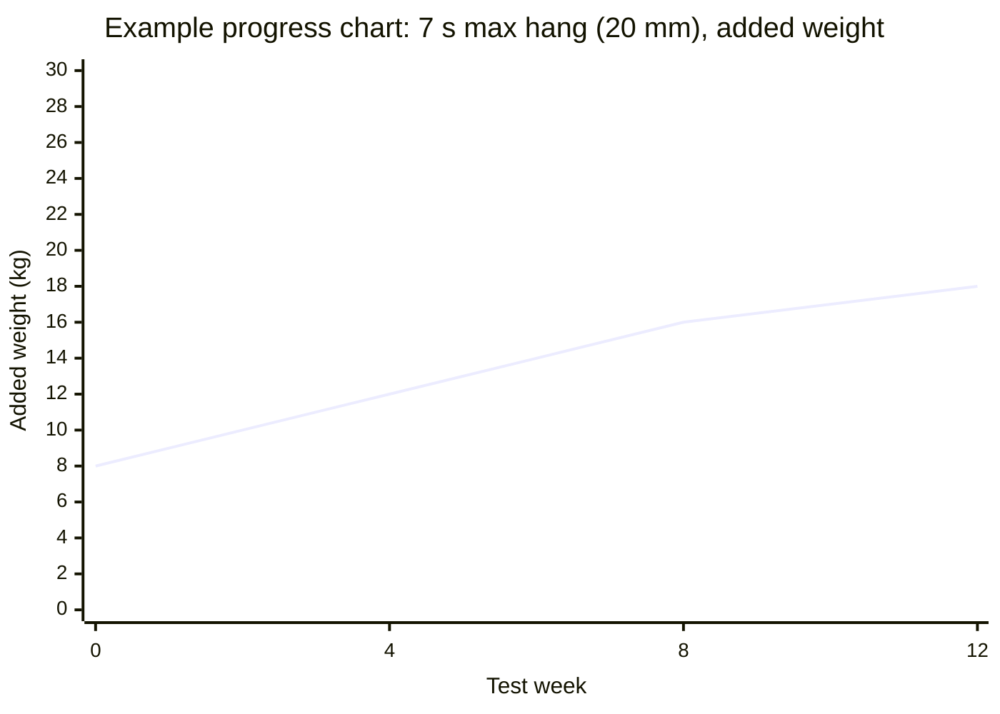
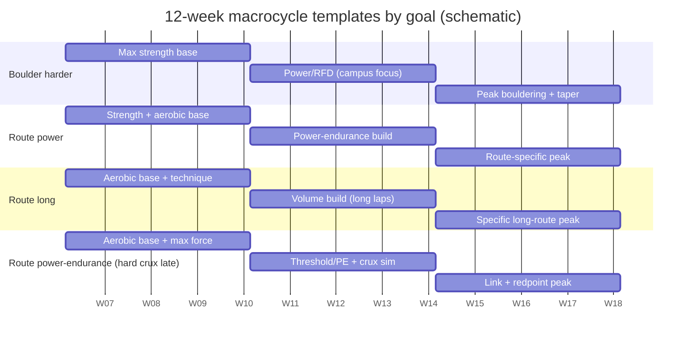

# Design Training Protocols for Rock Climbing Across Four Performance Goals

## Executive summary

Designing effective climbing training starts with a needs analysis of (a) effort duration and work:rest structure, (b) the dominant limiting physiological qualities (max finger force, rate of force development, anaerobic capacity/power-endurance, local aerobic capacity), and (c) the “skill bottleneck” (movement efficiency, tactical pacing, and crux execution). Competition time–motion research provides useful anchors for effort structure: bouldering attempts commonly cluster around ~20–30 seconds, while lead attempts average several minutes, with distinct hold contact times and reach times. citeturn4search4turn5view4 These differences justify goal-specific periodization rather than one “general climbing plan.” citeturn4search16turn5view4

Across disciplines, climbing-specific forearm/finger strength is repeatedly identified as a major performance correlate, while rate-of-force-development (RFD) and the ability to repeatedly produce force under intermittent ischemic conditions become increasingly discriminative at higher levels and in dynamic styles. citeturn8view0turn8view2turn12view2 Intervention evidence is still limited (few RCTs, small sample sizes), but meta-analytic synthesis indicates that climbing-specific resistance training (especially finger-flexor–focused) improves finger strength, RFD, and forearm endurance tests more than climbing alone, and may improve performance when training is specific and well-structured (e.g., resistance training or interval-style bouldering). citeturn12view2turn5view0

The four goal archetypes in this report differ primarily by the intensity–duration domain (maximal → sustained) and by where failure occurs (contact strength vs. pump vs. crux-under-fatigue). Each goal therefore uses a different “center of gravity” for weekly training:  
- **Boulder harder** emphasizes maximal finger force, RFD/contact strength, and high-quality limit attempts with long rests. citeturn8view0turn18view0  
- **Route power** emphasizes short-duration power-endurance and the ability to repeat near-limit sequences with incomplete recovery, while maintaining enough max strength that crux intensity is submaximal. citeturn7view2turn22search3  
- **Route long** emphasizes local aerobic capacity and efficiency so submax work stays below “pump threshold” longer; it is built with high-volume, low-intensity climbing plus periodic higher-intensity intervals. citeturn7view2turn20view0  
- **Route power-endurance with difficult cruxes** blends aerobic base + anaerobic capacity and specifically trains executing a hard crux after accumulated fatigue (crux-at-the-end specificity). citeturn7view2turn5view4

A consistent testing and monitoring system is essential because climbing performance is multifactorial and because standardized diagnostic procedures in the literature remain heterogeneous. citeturn5view3 This report includes a practical test battery (finger max strength, intermittent endurance or “critical force,” climbing-specific power/RFD proxies, performance tracking, and injury-risk screens), plus session/RPE-based load monitoring templates. citeturn7view0turn7view1turn12view0

Injury risk management is not optional: adult climbing injuries are frequently overuse-related, with fingers (notably pulleys) a common site, and load management is repeatedly highlighted as a modifiable factor. citeturn5view5turn11view1turn15search4 Consequently, all four training plans below include explicit deloads, progression rules, and “stop criteria” (pain/red flags), and they avoid normalizing taping as an injury-prevention strategy given the mixed/limited evidence. citeturn15search22

## Assumptions and evidence base

This report assumes an adult climber (18+), intermediate-to-advanced, who can train 4–5 days/week, has regular access to a gym (bouldering + routes), and has at least basic access to a hangboard, pull-up bar, and weights (or a loading/unloading system). It assumes no acute finger pulley tear, acute shoulder injury, or unresolved tendinopathy at program start; if present, the “Safety and injury-risk management” section becomes the priority constraint. citeturn5view5turn15search4

Grade examples are provided using common public scales (V-scale for bouldering, YDS/French for sport), but the plan is written to be measurable even without external grades by using repeatable tests (added-weight hangs, intermittent endurance repetitions/time, standardized circuits, and session logs). Standardized grade reporting in research frequently uses the reporting guidance of entity["organization","International Rock Climbing Research Association","climbing research consortium"] (IRCRA), which exists specifically to improve comparability across grade systems. citeturn9search2turn9search4

Because climbing-specific intervention studies are relatively sparse and heterogeneous, protocol prescriptions below combine (a) the strongest available climbing-specific training evidence, (b) validated/commonly used climbing diagnostics, and (c) established resistance training progression principles from entity["organization","American College of Sports Medicine","sports medicine organization"] (ACSM) for intensity, rest, and progressive overload. citeturn12view2turn11view4 Where evidence is limited (e.g., exact “best” ARC parameters for long-route performance), the report flags the recommendation as inference grounded in known energetic demands and in broader endurance training principles rather than as a directly proven climbing RCT outcome. citeturn7view2turn20view0

For alignment with “official” competition demand models, this report treats the load-structure literature and rules/standards associated with entity["organization","International Federation of Sport Climbing","global sport federation"] (IFSC) and entity["organization","USA Climbing","national governing body, us"] as reference points for effort structure and athlete-wellbeing emphasis, rather than as prescriptive training manuals (because publicly accessible federation documents are primarily rules, event guidance, and athlete-development priorities). citeturn5view4turn3search7turn2search24

## Testing, monitoring, and templates

### Why test batteries matter in climbing

Climbing diagnostics research identifies many possible tests but also emphasizes that procedures are not yet uniform and that quality indicators (validity/reliability) are inconsistently reported, limiting direct comparisons and making it important to standardize your own testing methods over time. citeturn5view3 A practical approach is therefore: pick a small set of high-signal tests, standardize them (edge size, grip, warm-up, rest, termination criteria), and repeat them strategically (baseline → mid-cycle → pre-peak). citeturn5view3turn12view2

### Core baseline assessments and objective metrics

The table below is a recommended “minimum viable” battery that covers strength, power/RFD proxy, endurance, technique proxy, and injury-risk indicators. Each test is chosen because it is either (a) frequently used in research with documented climbing relevance, or (b) anchored in validated training or diagnostic protocols.

**Finger max strength (primary KPI across most goals).** Climbing-specific finger strength tests (edge-hang style, not generic handgrip dynamometry) show strong associations with bouldering and redpoint performance in at least some cohorts, supporting their use as a central metric and as a guide for training load prescription. citeturn8view0turn20view0 A practical and research-aligned field test is a progressive-load 7-second hang on a ~20–22 mm edge with a standardized grip (commonly half crimp), using 2 minutes rest between attempts, and recording the maximum load held for the full 7 seconds. citeturn5view1turn7view4

**Finger endurance (choose one of two options depending on equipment).**  
- An intermittent finger endurance test at a fixed percentage of MVC with a prescribed work:rest ratio (e.g., 7:2 at 60% MVC) has been optimized for correlation with lead performance and offers explicit termination rules (force deviation tolerances). citeturn7view0  
- A “critical force” approach using a 4-minute all-out intermittent test (7:3) can provide a sustainable-intensity proxy plus an “above-threshold” work capacity construct, mirroring critical power concepts used in endurance physiology. citeturn7view1

**Power/RFD proxy.** Direct RFD measurement requires force sensors, but practical proxies include campus-board maximal reach and “moves to failure” tests, both used in controlled interventions. citeturn18view0turn5view2 RFD itself discriminates elite from advanced/intermediate climbers in climbing-specific testing contexts, supporting the inclusion of a power/RFD proxy when training goals require explosive contact. citeturn8view2

**Technique/pacing proxies.** Because efficiency (time on holds, route-reading/decision-making, pacing) matters especially as duration increases, include at least one standardized “movement economy” marker: e.g., time-to-complete a fixed circuit at a prescribed intensity, number of shakes/clips, or video-coded “stop time vs move time.” Load-structure research provides the conceptual basis (contact times and action counts differ by discipline). citeturn5view4turn4search10

**Injury-risk screens.** Adult climbing injury literature consistently highlights overuse and finger structures, so screen and track: finger pain (especially pulley-region tenderness), morning-after stiffness, and elbow/shoulder symptoms, alongside climbing load. citeturn5view5turn11view1turn15search4

### Suggested testing schedule across 12 weeks

A practical cadence is **Week 0 (baseline), Week 4 (post–mesocycle 1), Week 8 (post–mesocycle 2), Week 11–12 (pre-peak or post-peak)**, with Week 4 and Week 8 often embedded into a deload to reduce fatigue confounding. This reflects common block logic in climbing studies (4–5 week interventions are common) and aligns with progressive overload principles. citeturn12view2turn23view0turn18view0

### Test battery table template

| Domain | Test | Metric | Standardization rules | Typical frequency |
|---|---|---|---|---|
| Performance | Best boulder / best route (by your preferred style: redpoint, flash, etc.) | Grade + notes (style, attempts, conditions) | Same style definition each time; record attempts and conditions | Continuous logging; summarize every 4 weeks |
| Finger max strength | 7 s max hang on ~20–22 mm edge, two arms | Max total load (BW ± added/removed load), plus %BW | Same edge/grip; strict scap set; 2 min rest between attempts | Week 0, 4, 8, 11–12 |
| Finger endurance | Intermittent hang at 60% MVC, 7:2 (or 7:3) | Reps to failure / time to failure; force deviation tolerance | Calibrate MVC from same setup; same termination criteria | Week 0, 4/8, 11–12 |
| Anaerobic capacity proxy | 30 s all-out “finger test” (if available) or route/boulder interval to exhaustion | Mean force / time-to-stop | Same protocol every test | Optional; Week 0 and Week 8–12 |
| Power proxy | Campus max reach + moves to failure (or standardized dyno board test) | Highest rung; total moves | Same rung spacing/board; standardized warm-up | Week 0 and Week 8–12 (avoid if injury risk) |
| Upper-body strength | Weighted pull-up (3–5RM) or isometric pull on rung | Load or peak force | Same ROM; avoid kipping | Week 0 and Week 8–12 |
| Injury risk | Symptom checklist + ROM/strength checkpoints | 0–10 pain, morning stiffness, “next-day OK?” | Record before session and next morning | Weekly |

The finger max strength and finger endurance elements are aligned with common research protocols and optimized intermittent test structures. citeturn5view1turn7view0turn7view4turn23view0

### Training load monitoring method and log templates

A key limitation in climbing is quantifying mixed sessions (technique + strength + intervals). Session-RPE (sRPE)—the product of global session RPE and duration—has strong support as a simple, low-cost internal load measure across sports, including for non-steady-state and high-intensity work. citeturn12view1turn12view0 It is particularly useful for tracking monotony/strain trends across a mesocycle, and it aligns with injury-prevention logic emphasizing load management. citeturn11view1turn12view0

**Session log template (copy/paste).**

| Date | Goal block | Session type | Duration (min) | RPE (0–10) | sRPE load | Key work performed | Notes (sleep, pain, skin, psyche) |
|---|---|---|---:|---:|---:|---|---|
|  |  |  |  |  |  |  |  |

**Hangboard / finger session template (copy/paste).**

| Date | Protocol | Edge / grip | Load (kg) | Work x reps x sets | Rest | Quality notes (form, pain, slip) |
|---|---|---|---:|---|---|---|
|  | Max hangs / Intermittent / etc. | 20 mm half crimp |  |  |  |  |

**Climbing performance session template (copy/paste).**

| Date | Terrain | Session goal | Attempts | Sends | Hardest successful | Total “hard” moves (est.) | Recovery quality (1–5) |
|---|---|---|---:|---:|---|---:|---:|
|  |  |  |  |  |  |  |  |

### Sample progress chart

The chart below is a *synthetic example* showing how one might visualize a key KPI (two-arm 7 s max hang, added weight) across test weeks.

## Comparative analysis of goal demands

### Effort structure and energy-system implications

A practical way to differentiate the four goals is by the dominant *intensity–duration window* and the corresponding work:rest patterns.

Bouldering competition time–motion analysis reports mean attempt durations around ~29 seconds with rest periods between attempts on the order of ~1–2 minutes, emphasizing repeated high-intensity bursts separated by partial recovery. citeturn4search4 In international competition modeling, bouldering attempts are similarly described with average attempt durations around the high-20-second range. citeturn5view4 Lead climbing attempts, in contrast, show average climbing times around ~4 minutes in international competitions, with action counts and contact times that reflect sustained intermittent isometric work. citeturn5view4 These durations are close to the intensity domain where local aerobic metabolism contributes substantially, yet repeated isometric contractions can limit perfusion (the “pump” phenomenon). citeturn23view0turn7view2

Finger flexor test research that partitions energy contributions suggests that intermittent endurance tests can have a high aerobic contribution (in that particular lab model), while all-out short tests have higher anaerobic alactic contribution—supporting the logic that long-route goals need more aerobic development while bouldering-max goals need more neural/max-force and alactic emphasis. citeturn7view2

### Comparison table across the four goals

| Goal | Primary limiter (typical) | Main “engine” emphasis | Most specific climbing work | Key KPIs to track |
|---|---|---|---|---|
| Boulder harder | Max finger force + RFD/contact strength; power coordination | Anaerobic alactic + neural | Limit boulders, long rests; campus/RFD blocks | 7 s max hang; campus reach; max “limit” grade; attempts-to-send |
| Route power | Ability to repeat near-max sequences; short power-endurance | Anaerobic capacity (lactic) + rapid recovery | Short route intervals; hard links; 30–60 s efforts with incomplete rest | Interval volume completed at target intensity; redpoint rate on short routes; finger “stamina” |
| Route long | Local aerobic capacity + efficiency/pacing | Aerobic (local forearm) + economy | ARC / long continuous laps; high mileage at low intensity | Time-on-wall at low pump; circuit completion time at fixed intensity; intermittent endurance |
| Route power-endurance with hard crux | Execute crux under fatigue; manage “above-threshold” work late | Aerobic base + anaerobic work capacity (W′-like) | “Crux-at-end” simulations; long intervals with hard finish | Critical-force proxy (if used); late-crux success rate; # hard moves completed after fatigue |

The discriminator is not just “strength vs endurance,” but also how fatigue is accumulated and whether you must produce near-max force *late* in the effort (Goal 4), which changes how you time and position high-intensity work in the week. citeturn7view2turn5view4turn20view0

### Training timeline visualization

The diagram below shows a **schematic 12-week structure** (3 × 4-week mesocycles) for each goal. It illustrates *relative emphasis*, not a calendar commitment.

This 4-week mesocycle framing is consistent with how many climbing interventions are structured (often 4–5 weeks), and it also aligns with conservative load management logic for high-intensity finger training. citeturn12view2turn18view0turn23view0

image_group{"layout":"carousel","aspect_ratio":"16:9","query":["weighted hangboard max hang training climbers","campus board training laddering exercise","ARC training climbing traversing","sport climbing interval laps training"],"num_per_query":1}

## Periodized protocols and workouts by goal

### Boulder harder: maximal bouldering power and strength

**Goal definition.** Improve the capacity to perform and link a small number of very hard moves (often ~5–10 moves) where failure is usually caused by insufficient finger force, insufficient contact strength/RFD, or inability to coordinate high-force moves. This aligns with the bouldering time domain (tens of seconds per attempt) and with evidence that bouldering specialists are distinguished by climbing-specific strength and explosiveness measures. citeturn4search4turn13search4turn8view2

**Performance targets (examples).**  
- Grade examples: pushing from “limit” Vx to Vx+1–2 over a season, or shifting flash/second-go performance upward (e.g., V6→V7, V8→V9). (These are illustrative, not guaranteed.)  
- Objective targets: +5–15% increase in 7 s max hang load (20–22 mm) across 8–12 weeks; measurable improvement in campus-board maximal reach and/or “moves to failure” in a standardized test format. citeturn5view1turn18view0turn23view0

**Baseline assessment priorities.**  
1) 7 s max hang (20–22 mm) as the primary load anchor. citeturn5view1turn8view0  
2) Power proxy: campus max reach + moves to failure (only if safe). citeturn18view0  
3) Climbing performance: limit boulder benchmark set (same board/problems) with attempts-to-send and high-quality effort tracking. Competition load structure supports using ~20–30 s attempts with ample rest as the relevant window. citeturn4search4turn5view4  
4) Injury screen: finger and shoulder symptom baseline; overuse risk matters because the block uses high intensity on small tissues. citeturn5view5turn11view1

#### 12-week plan (with 24-week extension option)

This plan uses three 4-week mesocycles (3 loading weeks + 1 deload/test week). This mirrors common climbing intervention durations and gives repeatable test points. citeturn12view2turn23view0turn18view0

| Weeks | Mesocycle focus | Main stimulus | Key outputs to watch |
|---|---|---|---|
| 1–3 | Max strength accumulation | Max hangs + limit bouldering (long rests) | Hang load trend; attempt quality |
| 4 | Deload + test | Reduce volume ~40–60% | Re-test max hang; symptom check |
| 5–7 | Power/RFD block | Campus/RFD + dynamic limit boulders | Campus metrics; RPE and skin |
| 8 | Deload + test | Reduce volume; maintain intensity | Optional campus test; hang check |
| 9–11 | Specific peak | Project-style limit boulders; maintain finger strength | Send rate + recovery |
| 12 | Taper + performance week | Low volume, high quality | Peak attempts; finalize metrics |

**24-week extension:** run two 12-week cycles back-to-back, changing the limit-boulder style (e.g., compression → small edges → steep power) and shifting the strength emphasis (first cycle: max force; second cycle: RFD/contact), while keeping the same test anchors. citeturn18view0turn23view0

#### Weekly template (example microcycle)

| Day | Session | Intent |
|---|---|---|
| Mon | Limit bouldering + max hangs | High neural output; freshest day |
| Tue | Antagonist + mobility + easy technique volume | Support tissues; keep skill |
| Wed | Campus/RFD session + short limit boulders | Explosive/contact emphasis |
| Thu | Rest or very easy ARC/skill | Load management |
| Fri | Limit bouldering (different style) + pulling strength | Strength transfer + variety |
| Sat | Optional: low-intensity volume (easy climbs) | Recovery/aerobic support |
| Sun | Rest | Tendon/joint recovery |

This separation of high-intensity days is consistent with general resistance training principles (high intensity requires longer rest and careful sequencing). citeturn11view4turn11view1

#### Session-level workouts, intensity, volume, progression, deload

**Workout A: Max hangs (max strength anchor).**  
- Test-derived 1RM: 7 s max hang on 20–22 mm edge. citeturn5view1turn7view4  
- Training prescription (evidence-aligned): 6 × 10 s at ~85–95% of finger strength test 1RM, 2 min rest between reps. citeturn7view4  
- Frequency: 1–2×/week in Weeks 1–8; 1×/week maintenance in Weeks 9–12.  
- Progression rule: if all 6 reps are completed with strict position and no pain on two consecutive sessions, increase load by ~2–5% (small increments are preferred for fingers); general RT guidance supports 2–10% load increases when rep targets are exceeded, but finger tissues justify the conservative end of that range. citeturn11view4turn11view1  
- Deload: keep intensity, reduce total sets by ~40–60% on Week 4 and Week 8. citeturn11view1turn12view0

**Workout B: Campus board power/RFD block (Weeks 5–7).**  
A controlled campus-board intervention used four exercises, 4 sets each, 2–3 min rest, maximal effort/velocity, with rung depth progression allowed and explicit avoidance of full-crimp execution cues. citeturn18view0  
- Session structure (adapted from that protocol): choose 2 of the following per session (to keep sessions short and high quality):  
  - 1–4–7–10 ladder (match on top rung)  
  - “Ladder” max reach up then reverse  
  - “1–2–3” style reach (~75% max reach then pull through)  
  - “10 RM” = 10 consecutive moves so move 10 is near exhaustion citeturn18view0  
- Sets/rest: 4 sets per exercise; 2–3 min rest between sets; stop if velocity deteriorates substantially. citeturn18view0  
- Frequency: 1–2×/week (not 4× unless you are highly tolerant and reducing other intensity), using “block periodization” logic because this tool is high stress on fingers/shoulders. citeturn5view2turn18view0  
- Progression: progress rung depth gradually (e.g., 25→20→15 mm) only when form and pain-free execution are stable. citeturn18view0turn15search4

**Workout C: Limit bouldering session (primary specificity).**  
- Working sets: 4–8 “limit problems” (or sequences) at ~1–3 move failure range; 3–6 high-quality attempts each; 3–5+ minutes rest to preserve neural output.  
- Progression: increase difficulty (smaller holds/steeper angle/more complex coordination) rather than adding large volume; quality is the KPI. This is consistent with the bouldering effort domain and with the importance of high RFD/max force in harder climbing. citeturn4search4turn8view2turn8view0

**Auxiliary strength (pulling + core + antagonists).**  
Use ACSM programming logic for heavy pulling strength (e.g., weighted pull-ups 3–5 sets of 1–6 reps with long rests) during strength mesocycles, shifting toward lighter maintenance during peak, and maintain antagonist/rotator cuff work to support common injury sites. citeturn11view4turn11view1

---

### Route power: short, hard sport routes emphasizing power

**Goal definition.** Improve the ability to climb short, steep sport routes (or short cruxy pitches) where continuous efforts often last roughly 1–3 minutes and failure is typically forearm fatigue near/after the crux rather than single-move max strength. The lead domain is characterized by sustained intermittent actions and multi-minute attempts in competition modeling, which supports training that blends high intensity with controlled rest rather than purely maximal efforts. citeturn5view4turn4search16turn7view2

**Performance targets (examples).**  
- Grade examples: improving redpoint on a short-power project (e.g., 5.12b→5.12d or 7b→7c) over a cycle; increasing probability of sending routes near your limit within fewer burns. (Illustrative.)  
- Objective targets: improved completion of standardized interval sessions at fixed intensity (more work completed at same rest), improved intermittent endurance repetitions at 60% MVC, and stable/improving max hang (so “route power” gains aren’t just endurance in a weak-strength ceiling). citeturn7view0turn8view0turn23view0

**Baseline assessment priorities.**  
1) Finger max strength (7 s max hang) to ensure crux intensity is trainably submaximal. citeturn8view0turn5view1  
2) Intermittent endurance test (7:2 at 60% MVC) as a lead-relevant marker. citeturn7view0  
3) A standardized “power-endurance climb test” (e.g., a fixed steep circuit or 2–3 min route) with time-to-failure and “offs/pauses” recorded as technique/pacing markers. Load-structure evidence supports using multi-minute windows. citeturn5view4turn4search10  
4) Injury screen + load monitoring baseline (sRPE) because this block can accumulate high metabolic stress and high weekly fatigue. citeturn12view0turn11view1

#### 12-week plan (with 24-week extension option)

| Weeks | Mesocycle focus | Main stimulus | Key outputs to watch |
|---|---|---|---|
| 1–3 | Strength + aerobic base | Max hangs (or 80% hangs) + easy mileage/ARC | Hang load; low pump duration |
| 4 | Deload + test | Reduced volume; re-test strength + endurance | Intermittent reps; symptoms |
| 5–7 | PE build (short) | High-intensity intervals (routes or circuits) | Total interval work completed |
| 8 | Deload + test | Reduce volume; keep some intensity | Interval KPI; recovery |
| 9–11 | Specific peak | Route-specific redpoint burns + targeted intervals | Send rate; burn quality |
| 12 | Taper + attempt week | Low volume, high-quality attempts | Performance outcomes |

**24-week extension:** add a first 12-week block that emphasizes building finger strength and aerobic base (more conservative intensity), then a second 12-week block that shifts strongly toward high-intensity intervals and redpoint specificity. citeturn23view0turn7view2turn20view0

#### Weekly template (example microcycle)

| Day | Session | Intent |
|---|---|---|
| Mon | PE intervals (short) | Main hard stimulus |
| Tue | Easy mileage + mobility/antagonists | Aerobic/skill + tissue care |
| Wed | Max hangs + technique boulders | Maintain strength ceiling |
| Thu | Rest | Absorb |
| Fri | Route practice / redpoint burns | Specific execution |
| Sat | Easy endurance (ARC/long laps) | Recovery + aerobic support |
| Sun | Rest | Manage cumulative fatigue |

#### Session-level workouts and prescriptions

**Workout A: Hangboard at 80% (stamina + strength blend).**  
A 4-week hangboard intensity study found that training around ~80% of maximal finger strength improved maximal force as well as “stamina/endurance” measures more consistently than either very low (60%) or purely maximal (100%) protocols in that setup. citeturn23view0  
- Practical prescription: 2×/week for 4 weeks during Mesocycle 1, using intermittent repetitions around ~80% of your max hang capability (as estimated from 7 s test), or controlled hangs with foot assistance if needed.  
- Progression: increase load slightly or reduce assistance while maintaining target intensity and strict form. citeturn23view0turn11view4

**Workout B: Power-endurance intervals on terrain (goal-specific).**  
Evidence supports interval-style bouldering as an effective method to improve upper-limb endurance characteristics in high-level boulder athletes, and broader climbing training syntheses also identify interval bouldering as a plausible performance-improving stimulus. citeturn12view2turn22search3turn22search26  
- “Route-power” interval template: 6–10 repeats of a ~45–90 second “crux sequence” (or a short route section) at RPE ~8–9, with 1:1 to 1:2 rest (e.g., 60 s on / 60–120 s off), 2–3 sets total with 8–12 min between sets.  
- Progression: add reps (volume) first, then reduce rest modestly, then increase difficulty—one axis at a time to preserve specificity and manage injury risk. citeturn12view2turn11view1

**Workout C: Short route redpoint practice (technical + physiological integration).**  
Because climbing performance is not purely physiological, combining physical training with technical execution is repeatedly recommended in the research synthesis and is supported by findings that on-wall training tends to enhance technique measures even when strength measures are unchanged. citeturn21view0turn20view0  
- Prescription: 3–6 high-quality burns on a route with a short, hard crux; full rest 10–20 minutes between maximal burns; do not “junk volume” your way into fatigue.

---

### Route long: endurance-focused long routes

**Goal definition.** Improve the ability to climb long routes (sustained climbing for many minutes, potentially multiple cruxless sections) where failure is typically systemic or local endurance (pump, pacing errors, inefficient movement) rather than isolated max strength. Lead load structure and endurance physiology models support emphasizing aerobic contribution and movement economy as duration extends. citeturn5view4turn7view2turn20view0

**Performance targets (examples).**  
- Grade examples: improved “all-day” ability—more routes near your onsight or flash grade, improved endurance on long pitches, reduced number of rests/falls on sustained climbs. (Illustrative.)  
- Objective targets: +20–50% increase in time-on-wall at low pump (ARC benchmark), improved completion of a standardized long circuit at fixed perceived intensity, improved intermittent endurance test repetitions/time. citeturn7view0turn7view2turn20view0

**Baseline assessment priorities.**  
1) Intermittent finger endurance (lead-relevant). citeturn7view0  
2) Optional critical-force test (if you can measure force): helps define a sustainable intensity concept for long efforts. citeturn7view1  
3) ARC benchmark: continuous easy climbing time at “light pump” with consistent breathing and minimal forearm pain; record duration and perceived pump. (This is more field-based than lab-validated; treat it as an internal benchmark.) citeturn20view0  
4) Technique proxy: video-coded pauses, overgripping signs, and pacing errors on a standard route/circuit. Load-structure data support using contact-time and action patterns as meaningful descriptors. citeturn5view4turn4search10

#### 12-week plan (with 24-week extension option)

| Weeks | Mesocycle focus | Main stimulus | Key outputs to watch |
|---|---|---|---|
| 1–3 | Aerobic base + technique | ARC / easy mileage; technique refinement | Low-pump duration; efficiency notes |
| 4 | Deload + test | Reduce volume; re-test endurance | Intermittent reps; symptom trends |
| 5–7 | Volume build | Longer continuous laps; some “steady hard” | Total minutes at target intensity |
| 8 | Deload + test | Reduce volume; keep 1 “quality” session | Recovery + minor KPI update |
| 9–11 | Specific endurance + tactics | Long-route simulations; pacing drills | Less stop time; better shakeouts |
| 12 | Taper + performance week | Reduce fatigue | Long-route outcomes |

**24-week extension:** extend Mesocycle 1 and 2 (aerobic base + volume build) to 16 weeks total before entering an 8-week specificity/peak window, because aerobic adaptations and movement economy improvements often benefit from longer accumulation, and because overuse risk rises when intensity is added on top of insufficient base. citeturn11view1turn7view2turn20view0

#### Weekly template (example microcycle)

| Day | Session | Intent |
|---|---|---|
| Mon | ARC / easy continuous climbing | Aerobic base + movement economy |
| Tue | Antagonist + mobility + very easy skill | Tissue balance |
| Wed | Moderate endurance (long laps) | Build time-on-wall |
| Thu | Rest | Absorb |
| Fri | Route mileage (varied styles) | Specificity + tactics |
| Sat | Optional: max hang maintenance (low volume) | Maintain strength ceiling |
| Sun | Rest | Load control |

#### Session-level workouts and prescriptions

**Workout A: ARC-style continuous climbing (aerobic base).**  
Climbing success determinants syntheses highlight the role of forearm aerobic capacity and efficiency; for long routes, the practical implication is sustained easy climbing with controlled breathing and minimal pump as a base stimulus. citeturn20view0turn7view2  
- Prescription: 20–45+ minutes continuous (or near-continuous) climbing at very low intensity (light pump), using traversing or up/down routes; keep intensity low enough that you can sustain the session.  
- Progression: extend duration first (time), then slightly increase terrain difficulty while keeping perceived pump modest.  
- Monitoring: keep sRPE low-to-moderate; if next-day finger tenderness rises, reduce volume. citeturn12view0turn11view1

**Workout B: Long intervals (“steady hard” laps).**  
Finger-flexor energetic profiling suggests that intermittent endurance work can have substantial aerobic contribution and is relevant to lead-style demands, supporting longer intervals that sit below full failure but accumulate fatigue. citeturn7view2turn5view4  
- Prescription: 3–5 repeats of 6–10 minutes on / 4–6 minutes off at a sustainable but challenging intensity (able to continue without falling).  
- Progression: add total work time (minutes) week-to-week for 2–3 weeks, then deload.

**Workout C: Strength maintenance (minimal effective dose).**  
Even in endurance-focused cycles, maintaining finger max strength helps keep long-route holds at a lower percentage of max, which is a plausible mechanism for delaying fatigue; this logic is consistent with the observed importance of climbing-specific finger strength. citeturn8view0turn20view0  
- Prescription: 1×/week max hangs at 85–90% for 4–6 total reps (not full 6×10s) during Weeks 5–12. citeturn7view4turn11view4

---

### Route power-endurance longer with difficult cruxes

**Goal definition.** Improve the ability to climb longer routes that include a crux near the end or after substantial fatigue accumulation—requiring (a) an aerobic base for recovery between moves and shakeouts, (b) anaerobic capacity/work capacity for sustained hard sequences, and (c) the ability to express high force under fatigue. This aligns with lead’s multi-minute action structure and with the concept that both maximal force and all-out capacity measures can be decisive indices in climbing-specific testing contexts. citeturn5view4turn7view2turn8view0

**Performance targets (examples).**  
- Grade examples: improved redpoint probability on long cruxy routes; fewer “high point” failures and fewer attempts needed to link past crux. (Illustrative.)  
- Objective targets: improved “late-crux success rate” in simulation sessions, improved intermittent endurance and/or critical-force proxy, and maintained or mildly improved max hang. citeturn7view0turn7view1turn8view0

**Baseline assessment priorities.**  
1) Finger max strength (7 s hang) plus a fatigue-resistance metric (intermittent test or critical-force). citeturn7view0turn7view1turn5view1  
2) A standardized “crux after fatigue” benchmark: climb a moderate circuit for 2–3 minutes, then immediately attempt a fixed crux boulder; score completion. (Field-based but highly specific.)  
3) Load monitoring baseline (sRPE + symptom tracking) because this goal often tempts “too much hard climbing,” raising overuse risk. citeturn12view0turn11view1

#### 12-week plan (with 24-week extension option)

| Weeks | Mesocycle focus | Main stimulus | Key outputs to watch |
|---|---|---|---|
| 1–3 | Aerobic base + max force | ARC + max hangs (or 80% blend) | Low-pump duration + hang stable |
| 4 | Deload + test | Reduce volume; re-test | Endurance reps; pain signals |
| 5–7 | Threshold/PE build | Longer intervals + crux-under-fatigue drills | Simulation success trend |
| 8 | Deload + test | Reduce volume; keep 1 hard session | Recovery quality |
| 9–11 | Specific linking | Link segments; full burns with long rest | High-point improves |
| 12 | Taper | Low fatigue, high quality | Peak redpoint tries |

**24-week extension:** use weeks 1–12 as a base-building cycle, then run a second 12-week cycle with higher specificity (more crux-under-fatigue structure, fewer generic intervals). This is consistent with the limited but consistent message that specificity matters and that interventions are often short blocks layered on top of ongoing climbing. citeturn12view2turn20view0turn22search26

#### Weekly template (example microcycle)

| Day | Session | Intent |
|---|---|---|
| Mon | Long intervals + short crux finisher | “Fatigue then crux” specificity |
| Tue | Easy mileage + mobility | Restore |
| Wed | Max hangs (low volume) + technique | Maintain max force ceiling |
| Thu | Rest | Absorb |
| Fri | Route linking / redpoint rehearsal | Specific |
| Sat | ARC / easy endurance | Aerobic support |
| Sun | Rest | Load control |

#### Session-level workouts and prescriptions

**Workout A: “Crux-at-end” simulation (core session).**  
- Part 1: 2–4 minutes continuous climbing on moderate terrain (not failure).  
- Part 2 (immediate): attempt a fixed 6–12 move crux boulder/sequence at high intensity (RPE 9).  
- Rest 10–15 minutes; repeat 3–5 times.  
Rationale: lead load structure involves multi-minute climbing, so practicing hard execution after sustained work is directly specific. citeturn5view4turn7view2

**Workout B: Intermittent finger endurance (60% MVC, 7:2 or 7:3).**  
Optimized intermittent endurance testing uses ~60% MVC and a prescribed work:rest ratio; this can be repurposed as a training session when properly dosed, and it provides a quantifiable progression path (reps/time). citeturn7view0turn7view1turn7view2  
- Training prescription: 3–5 sets of intermittent hangs with strict termination criteria before form collapse; rest ~2–3 minutes between sets.

**Workout C: Max strength maintenance (minimal dose).**  
Use the Gilmore-style max hang structure but reduce volume during the PE-heavy mesocycles: 4–6 total reps of 10 s at 85–95% 1RM, 2 min rest, 1×/week. citeturn7view4turn11view4

**Progression and deload principles (for Goal 4).**  
- Progress one variable at a time (either increase total work, increase crux difficulty, or reduce rest), then stabilize for 1 week.  
- Every 4th week, reduce total high-intensity volume substantially while maintaining some intensity to retain adaptations; this is consistent with load-management logic emphasized in injury-prevention reviews and with periodization monitoring via sRPE. citeturn11view1turn12view0

## Safety and injury-risk management

### What the injury literature implies for training design

Adult climbing injury evidence synthesis indicates that overuse injuries are common and that fingers—particularly pulley structures—are frequent problem areas, which supports conservative progression, explicit deloads, and careful monitoring of finger pain and next-day symptoms. citeturn5view5turn11view1turn15search4 For pulley injuries specifically, systematic reviews in the hand/orthopedic literature emphasize that pulley injuries are disproportionately associated with climbing compared to the general population, reflecting climbing’s unique loading demands. citeturn15search4turn15search6

The practical translation is: (1) treat finger strength as high benefit but high risk, (2) prioritize load management as a modifiable risk factor, and (3) build tissue tolerance progressively before adding high-velocity tools (campus board, dynamic small-edge moves). citeturn11view1turn18view0turn15search4

### Safety rules integrated into all four protocols

**Stop criteria (non-negotiable).**  
- Sharp “pop,” sudden pain, or rapid swelling in a finger: stop and seek clinical evaluation (pulley injuries often require imaging for grading). citeturn15search6turn15search16  
- Pain that worsens during the session, or pain/stiffness significantly worse the next morning: reduce intensity and volume and reassess. Overuse risk mitigation emphasizes monitoring and load adjustment. citeturn11view1turn5view5

**Warm-up requirements for finger intensity.**  
Fingerboard/campus protocols in research are performed after warm-ups and with explicit technique constraints (e.g., avoiding full crimp during campus training supervision). citeturn18view0turn23view0 Practically: gradual recruitment (easy climbing → progressive hangs → only then maximal work) is mandatory.

**Deloads are a safety feature, not just a performance feature.**  
Given the dominance of overuse patterns and the importance of load management, deload weeks (volume reduction) should be considered part of injury prevention. citeturn11view1turn12view0

**Taping is not a substitute for load management.**  
Evidence syntheses suggest that taping may reduce bowstringing but has no clear effect on MVC or muscle activation in uninjured climbers and has low-to-moderate certainty across outcomes; therefore, it should not be relied on as primary prophylaxis. citeturn15search22turn15search12

### Safety considerations by tool

**Hangboard.**  
- Use standardized edge depth and grip; avoid adding both intensity and volume in the same week.  
- If returning from time off or if injury risk is high, lower-intensity hangboard training (e.g., ~60% in the force-feedback study) improved endurance-type measures with lower force demand, suggesting a potential “return-to-load” option, though direct performance transfer is still uncertain. citeturn23view0turn12view2

**Campus board.**  
Campus board training is effective in short blocks for climbing-specific attributes in advanced climbers, but it is also explicitly described as high stress on fingers/shoulders/elbows; the intervention includes maximal effort with controlled rest and avoidance of high-risk grip positions during supervised learning. citeturn18view0turn5view2 Use it as a *block* (e.g., 4–6 weeks), and reduce other high intensity while it is emphasized. citeturn18view0turn11view1

**High-intensity intervals (“power-endurance”).**  
Intervals raise systemic and local fatigue quickly; use sRPE trends to prevent “hidden overload,” because training load monitoring can help manage injury risk in principle, and overuse injury prevention reviews repeatedly emphasize programming and load as modifiable factors. citeturn12view0turn11view1

### Minimal practical checklist (weekly)

| Item | Threshold | Action |
|---|---|---|
| Finger pain during session | >3/10 or sharp | Stop finger intensity; switch to easy technique/endurance |
| Next-morning finger stiffness | increasing trend | Reduce total intensity volume next week |
| sRPE monotony | repeated high, little variation | Insert deload or replace one hard day with low intensity |
| Skin condition | frequent splits | Reduce abrasive volume; prioritize quality attempts |

This style of weekly monitoring is consistent with the need for trackable target outcomes and disciplined planning emphasized in coaching frameworks and training-load monitoring literature. citeturn3search6turn12view0